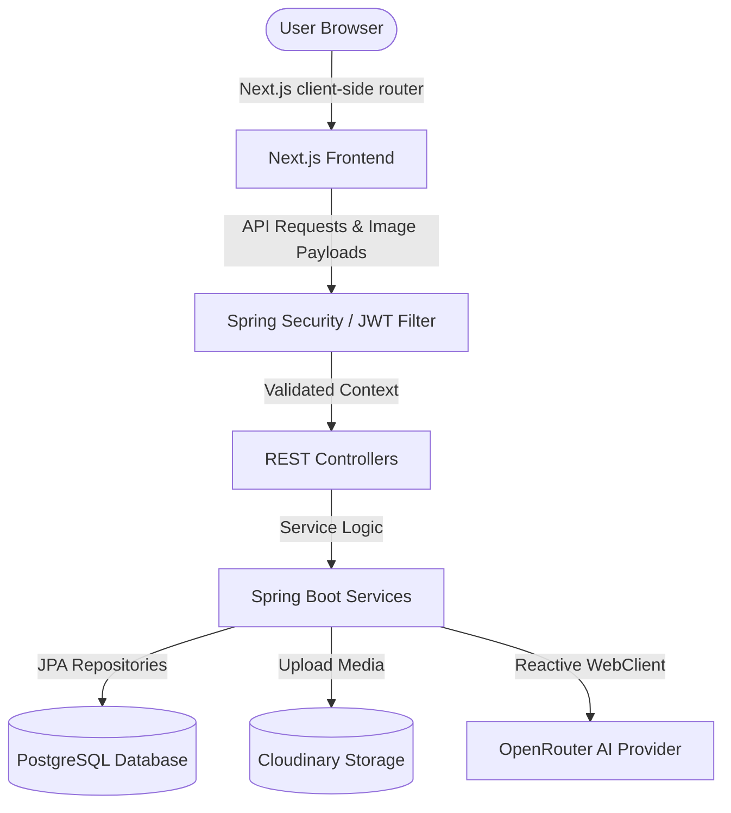

# Dwellix: AI-Powered Home Management Operating System

[](https://nextjs.org/)
[](https://spring.io/projects/spring-boot)
[](https://www.postgresql.org/)
[](LICENSE)

Dwellix is a premium, modern home management platform designed to serve as an operating system for residential home ownership. The platform optimizes household organization by structuring appliance catalogs, digitizing receipts, tracking warranties, automating scheduling, and using state-of-the-art AI Workspace tools for home issue diagnostics.

---

## 🚀 Key Features

*   **Premium AI Assistant Workspace**: Interactive chat interface styled after Claude/ChatGPT, featuring context panels, dynamic conversation history grouping, voice input recognition, and home parameters integration (powered by OpenRouter AI).
*   **Appliance Registry & Health Score**: A structured catalog of home appliances with model numbers, placement details, and computed health status.
*   **Warranty & Invoice Vaults**: A secure media storage pipeline using **Cloudinary** integration on the backend to host appliance invoices, specs, and warranties, alerting users when expiration dates draw near.
*   **Interactive Onboarding Wizard**: A step-by-step custom wizard allowing users to setup their home configuration, rooms, and appliances upon registration.
*   **Maintenance Scheduler & Bookings**: Real-time technician dispatching, maintenance cycle trackers, and schedule builders.

---

## 🛠️ Tech Stack

*   **Frontend**: Next.js 16 (React 19, TypeScript), Tailwind CSS, Vanilla CSS custom modules, Framer Motion, Lucide React icons, Radix UI primitives.
*   **Backend**: Spring Boot 3.5 (Java 21), Spring Security 6 (JWT cookie-based auth, Google OAuth2 Login), Spring WebFlux (Reactive WebClient for AI integrations), Flyway migrations.
*   **Database**: PostgreSQL.
*   **Cloud & Storage**: OpenRouter API (LLM integration), Cloudinary Java SDK (media hosting).

---

## 🗺️ Architecture Overview

Dwellix separates concerns into an SPA frontend, a secure REST API backend, and cloud integrations. 

### System Flow


---

## 📁 Folder Structure

```
Dwellix/
├── assets/             # Project static assets & illustrations
├── backend/            # Spring Boot REST API
│   ├── src/            # Java backend source code
│   ├── pom.xml         # Maven build settings
│   └── mvnw.cmd        # Maven wrapper executable
├── branding/           # Project brand assets, logos, and styles
├── database/           # Database schema representations
├── deployment/         # Docker, Nginx, and monitoring configs
├── docs/               # Detailed system documentation
├── frontend/           # Next.js SPA
│   ├── src/            # TSX components, pages, and features
│   ├── public/         # Static client assets
│   └── package.json    # npm configurations
├── README.md           # This document
├── LICENSE             # Project license
└── render.yaml         # Multi-service deployment blueprints
```

---

## ⚙️ Installation & Setup

Please refer to [docs/SETUP.md](file:///c:/Users/shive/Desktop/Dwellix/docs/SETUP.md) for full configuration parameters.

### Prerequisites
*   Java Development Kit (JDK 21+)
*   Node.js (v18+) & npm
*   PostgreSQL server instance

### 1. Database Setup
Create a PostgreSQL database named `dwellix`:
```sql
CREATE DATABASE dwellix;
```

### 2. Environment Configurations
Setup the environment files:
*   Configure the database URL, credentials, and JWT secrets in the environment variables.
*   Configure API credentials for **Cloudinary** and **OpenRouter** (required for invoice storage and AI diagnostic workspace).

### 3. Running Backend
Navigate to `/backend` folder:
```bash
# Build the application
./mvnw clean package -DskipTests

# Start the Spring Boot REST API
java -jar target/dwellix-backend-0.1.0.jar
```

### 4. Running Frontend
Navigate to `/frontend` folder:
```bash
# Install package dependencies
npm install

# Start Next.js client-side server
npm run dev
```
Access [http://localhost:3000](http://localhost:3000) to view the client application.

---

## 🔑 Authentication Flow

Dwellix implements a dual-token JWT security model designed to resist XSS and CSRF attacks:
1.  **Access Token**: Transmitted in the response payload and maintained in memory by the Next.js client.
2.  **Refresh Token**: Saved in an `HttpOnly`, `Secure`, `SameSite=None/Lax` cookie.
3.  **Token Rotation**: Access tokens are automatically refreshed in the background before expiration using the HTTP-only cookie.
4.  **Google OAuth2 Login**: Spring Security delegates authentication to Google and redirects back to the frontend with token configurations.

---

## 📸 Project Screenshots

| Dashboard Home | AI Chat Workspace |
| :---: | :---: |
|  |  |

---

## 🌐 Deployment

Dwellix is ready for multi-service hosting. The `render.yaml` blueprint automates the deployment of the Spring Boot REST API as a Docker container, mapping database and secret credentials dynamically. Next.js can be deployed on Vercel or Render. For local containerization settings, see [docs/DEPLOYMENT.md](file:///c:/Users/shive/Desktop/Dwellix/docs/DEPLOYMENT.md).

---

## 📜 License & Author

Licensed under the [MIT License](LICENSE).

Developed with ❤️ by Shivesh.