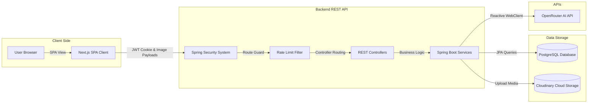

# System Architecture - Dwellix

Dwellix is divided into a standalone client SPA (Single Page Application) and a decoupled REST API backend communicating via stateless JSON payloads and HTTP cookies.

---

## 🏛️ Overall Component View

---

## 📱 Frontend Component Stack (Next.js 16)

*   **React Router & State**: Next.js App Router controls page state. State is managed locally via React Context/Reducers.
*   **Aesthetics**: Glassmorphism dashboard templates, Outfit/Inter typography, harmonious Slate and Indigo gradients.
*   **Micro-interactions**: Framer Motion powers page loaders, custom cursor dynamics, dashboard transitions, and slide animations in the Onboarding Wizard.

---

## ☕ Backend Core Services (Spring Boot 3.5)

*   **Auth Module**: Validates token signatures, runs security context bindings, and handles Google OAuth2 redirects.
*   **AI Diagnostics**: Context integration engine (`AiContextService`) fetches home settings, structures room parameters, feeds them into LLM prompt templates, and handles fallback logic via OpenRouter API.
*   **Onboarding Service**: Maps Multi-step wizards requests to transaction-locked database insertions (creating rooms, configuring homes, listing appliances).

---

## 💾 Database Schemas

All table mappings are sequentially cataloged in Flyway migrations:
1.  **Authentication**: Users, OAuth mappings, refresh/reset tokens.
2.  **Onboarding Model**: `homes`, `rooms`, `appliances`.
3.  **Workspace AI Conversations**: `ai_conversations` (uuid linked), `ai_messages` (role, content, timestamp).
4.  **Booking Dispatch**: `technicians` (skills, ratings), `technician_bookings` (scheduled dates, statuses).
